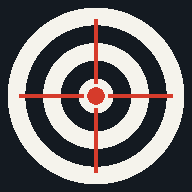

# Мушкетон-тренер

Офлайн PWA для тренера по пулевой стрельбе (ISSF, 10 м, пневматический пистолет).

Тренер смотрит на монитор электронной мишени и вручную вносит место попадания:
тап по мишени → перетаскивание для уточнения → живой десятичный ISSF-счёт →
отпускание фиксирует выстрел.

---

## Содержание

- [Установка на телефон](#установка-на-телефон)
- [Первый запуск](#первый-запуск)
- [Спортсмены](#спортсмены)
- [Тренировки](#тренировки)
- [Ввод выстрела](#ввод-выстрела)
- [Редактирование и отмена](#редактирование-и-отмена)
- [Все выстрелы](#все-выстрелы)
- [Комментарии к выстрелам](#комментарии-к-выстрелам)
- [Резервное копирование и восстановление](#резервное-копирование-и-восстановление)
- [AI-анализ](#ai-анализ)
- [Данные и конфиденциальность](#данные-и-конфиденциальность)

---

## Установка на телефон

Откройте ссылку в браузере телефона: [https://sst1xx.github.io/mushketon-coach/](https://sst1xx.github.io/mushketon-coach/)

Чтобы добавить приложение на рабочий стол и работать как с обычным приложением:

- **Android (Chrome):** откройте ссылку, нажмите `⋮` → **Добавить на главный экран** (или **Установить приложение**) и подтвердите.
- **iPhone (Safari):** откройте ссылку в Safari, нажмите **Поделиться** → **На экран «Домой»** → **Добавить**.

После установки приложение работает полностью офлайн — интернет нужен только для первой загрузки и обновления.

---

## Первый запуск

При первом открытии отображается экран **Спортсмены**. Создайте хотя бы одного спортсмена, чтобы начать работу — другие функции недоступны до выбора спортсмена.

---

## Спортсмены

- **Создание:** кнопка «+» на экране Спортсмены → введите имя → сохранить.
- **Переключение:** вернитесь на экран Спортсмены (кнопка «Назад») и выберите другого спортсмена. Текущие тренировки всех спортсменов сохраняются независимо — переключение не сбрасывает данные.
- **Удаление спортсмена** требует подтверждения; при удалении удаляются все его тренировки и выстрелы.

---

## Тренировки

После выбора спортсмена открывается список его тренировок.

**Создание тренировки** — две кнопки в нижней части экрана:

- **+ Новая серия** — серия на 10 выстрелов. Счётчик `выстрел/10` отображается в заголовке. При достижении 10 выстрелов серия завершается автоматически и появляется диалог выбора следующего шага.
- **+ Новое упражнение** — упражнение ПП-3: 60 выстрелов, разбитых на 6 серий по 10. Прогресс серий отображается в виде чипов-блоков: текущая серия и пройденные серии видны на экране тренировки. Каждая серия завершается автоматически при 10 выстрелах.

**Режим ПП-3** — после завершения каждой серии появляется диалог с кнопкой **«Начать новую»** (переход к следующей серии) или просмотром завершённой серии. После 6 серий всё упражнение считается завершённым. Завершённые серии доступны для просмотра и редактирования через чипы в заголовке.

**Продолжить тренировку:** нажмите на любую тренировку в списке — она откроется, и можно добавлять новые выстрелы.

Тренировки, созданные ранее без лимита выстрелов, остаются доступными — они продолжают работать как неограниченная последовательность выстрелов.

На экране тренировки отображаются все попадания на мишени ISSF; более ранние выстрелы показаны менее ярко.

---

## Ввод выстрела

1. **Тап** по мишени — ставит маркер выстрела в точку касания.
2. **Удержание и перетаскивание** — уточняет положение; лупа показывает увеличенную область вокруг точки касания для точного позиционирования.
3. **Отпустить** — фиксирует выстрел (статус `committed`).

Десятичный счёт ISSF (0–10.9) рассчитывается мгновенно и отображается рядом с маркером в реальном времени. Промах (выстрел за пределами мишени) фиксируется как 0.

---

## Редактирование и отмена

- **Отмена последнего выстрела:** кнопка «Отмена» убирает последний добавленный выстрел.
- **Редактирование:** любой выстрел можно открыть и перетащить маркер на новое место — как при первом вводе.
- **Удаление выстрела** требует подтверждения.

---

## Все выстрелы

На экране списка тренировок (у выбранного спортсмена) есть кнопка **«Все выстрелы»** — сводный список попаданий по всем тренировкам с фильтрацией и возможностью просмотра на мишени.

---

## Комментарии к выстрелам

К каждому выстрелу можно добавить текстовый комментарий (заметку тренера). Кнопка **«Дневник»** на экране списка тренировок открывает раздел с комментариями: все заметки привязаны к выстрелам, сгруппированы по тренировкам и сериям. Можно добавлять общие заметки к тренировке или серии, а также редактировать комментарии отдельных выстрелов.

---

## Резервное копирование и восстановление

Раздел **Настройки** (значок шестерёнки):

- **Создать резервную копию** — экспортирует все данные (спортсмены, тренировки, выстрелы, комментарии) в один JSON-файл на устройство.
- **Восстановить из копии** — импортирует JSON-файл; операция требует подтверждения, после чего все текущие данные заменяются данными из файла.

Рекомендуется регулярно сохранять резервную копию, особенно перед очисткой браузера.

---

## AI-анализ

В **Настройках** → раздел «Анализ с AI»:

1. Войдите через **OpenRouter** (достаточно бесплатного аккаунта).
2. Выберите модель из автоматически загружаемого списка бесплатных моделей. При необходимости можно ввести ID любой другой модели OpenRouter вручную.
3. Выберите одну или несколько тренировок для анализа.
4. Нажмите «Анализировать» — приложение отправит все данные выстрелов и комментарии выбранных тренировок в модель и покажет ответ во всплывающем окне.

Данные уходят только в OpenRouter API при явном запросе анализа. В остальное время приложение полностью офлайн.

---

## Данные и конфиденциальность

- Все данные хранятся локально на вашем устройстве в IndexedDB браузера.
- Нет бэкенда, нет аккаунтов, нет синхронизации и облачных сервисов.
- Данные привязаны к конкретному браузеру и устройству. Для переноса используйте резервную копию.
- Очистка данных браузера или удаление PWA с рабочего стола может привести к потере данных — регулярно создавайте резервные копии.
