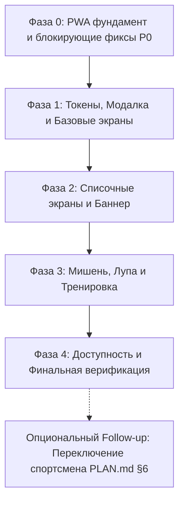

# План: Mobile-First UX/UI и поэтапная миграция стилей на CSS Modules

**Дата:** 2026-08-21  
**Статус:** 📋 На согласовании (Ready for Review)  
**Область:** UI/UX, стили, мобильное взаимодействие, доступность  
**Ветки / Worktree:** `wt-mobile-ux` (`mobile-ux`)  

---

## 1. Контекст и решения владельца продукта

`mushketon-coach` — офлайн PWA для тренера по пулевой стрельбе (ISSF 10 м пневматический пистолет). Мобильные устройства (смартфоны) в портретной ориентации — ключевая целевая платформа.

### 1.1 Зафиксированные решения и ограничения
1. **Промахи (score 0) вне мишени:** Намеренно **игнорируются** и не входят в план. Приложение предназначено для высококлассных спортсменов; ввод попаданий ограничен габаритом мишени (ISSF). Чистые модули `src/scoring.ts` и `src/transform.ts` не модифицируются.
2. **Нулевые новые зависимости:** Никаких новых runtime-библиотек (CSS-in-JS, UI-китов, иконочных шрифтов, внешних шрифтов, аналитики, бэкенда). Стек остается: React 18, TypeScript, Vite 5, CSS Modules (встроенные в Vite), IndexedDB.
3. **Чистые слои:** `src/scoring.ts` и `src/transform.ts` остаются 100% чистыми функциями без React, DOM и I/O.
4. **Неделимость этапов:** Никакого "big-bang" рефакторинга. Поэтапная миграция экран за экраном / фича за фичей. На каждом шаге приложение полностью работоспособно, все тесты зеленые.
5. **Строгие правила процессов:** `main/` только для чтения; реализация только через `worker` в worktree `wt-*`; обязательное ревью после каждой фазы/задачи; коммиты и деплои только по явной команде пользователя.
6. **Главный приоритет — установка PWA на рабочий стол телефона:** Приложение должно открываться на мобильном устройстве и полноценно устанавливаться («Добавить на главный экран») с итоговым URL на **GitHub Pages subpath** (например, `/mushketon-coach/`). `manifest.start_url`, `manifest.scope` и Vite `base` должны быть согласованы с этим subpath, а не с корнем домена.
7. **PWA-иконка — временное решение:** Создаётся простая одноразовая иконка `192×192` и `512×512` (единый плейсхолдер, например залитый квадрат с инициалами/мишенью без нового брендинга) **один раз**, только для прохождения installability-критериев браузера. Иконка в дальнейшем будет заменена отдельной задачей без изменения манифеста/архитектуры — это не блокирует данный план.
8. **Ориентация — только portrait, поворот экрана не поддерживается:** Приложение работает исключительно в портретной ориентации телефона. Ландшафтная раскладка **исключена из обязательного DoD** и не реализуется в рамках данного плана.
9. **Rollback не зависит от git commit:** Все правила см. в разделе 7. Коммит **не является частью реализации фаз** и не требуется для отката; допускается только по отдельному явному разрешению владельца.
10. **Это новая версия приложения — миграции данных не требуются и не входят в scope:** Текущая версия `mushketon-coach` рассматривается как новая версия приложения. Никакая миграция существующих данных, upgrade path для старых записей IndexedDB, изменение/версионирование схемы хранилища или обеспечение обратной совместимости со старыми данными **не реализуются и не проектируются** в рамках данного плана. Приложение может начинать работу с чистого локального хранилища (пустой IndexedDB). Любые изменения `src/db/` (схема, версия, `onupgradeneeded`), любой migration-код, экраны/диалоги для конвертации старых данных — **вне scope**. `worker` не должен писать migration-код ни в одной из фаз плана; если задача плана кажется требующей изменения схемы БД — это признак выхода за рамки плана, требующий остановки и эскалации, а не самостоятельного решения.

---

## 2. Анализ текущего состояния UI/UX

| Компонент / Экран | Текущее состояние | Выявленные проблемы на мобильных устройствах |
|---|---|---|
| `src/index.css` + `index.html` | Минимальный базовый CSS (24 строки), `html, body, #root` имеют `overflow: hidden; height: 100%`. В `index.html` отсутствует `viewport-fit=cover`, `theme-color`, iOS standalone meta. | Блокирует скролл дочерних страниц без явного скролл-контейнера. Нет учета notch/home indicator. |
| `src/App.tsx` | Инлайн-стили экрана загрузки/ошибки (`src/App.tsx:41-42` — `style={styles.center}`). | Нарушение единой стилевой системы, отсутствие модульной изоляции. |
| `src/main.tsx` | Инлайн-стиль экрана неподдерживаемого браузера (`src/main.tsx:60` — `style={{ padding: 24, ... }}`). | Нарушение единой стилевой системы. |
| `AthletesScreen.tsx` | Инлайн-стили `s: Record<string, CSSProperties>`. Список рендерится в `div style={s.page}` без `overflow-y: auto`. | **P0 Blocker:** При >5 спортсменах список не скроллится, кнопка создания недостижима. Кнопки удаления `delBtn` ~21px высоты (ложные нажатия). Нет `:active`. |
| `TrainingsScreen.tsx` | Инлайн-стили, `s.page` без скролла. Модалка создания/удаления в инлайне. | **P0 Blocker:** Список тренировок не скроллится. Мелкие кнопки удаления (`padding: '0 4px'`). Нет Esc/backdrop close. |
| `RemarksScreen.tsx` | Инлайн-стили, `s.page` без скролла. Textarea с `fontSize: 15px`. | Не скроллится при длинном списке замечаний. Safari зумит экран при фокусе на textarea (<16px). |
| `SettingsScreen.tsx` | Инлайн-стили, `s.page` без скролла. Модалки бэкапа/сброса. | Не скроллится на малых экранах (iPhone SE). Мелкие зоны нажатия кнопок экспорта/импорта. |
| `TrainingScreen.tsx` | Инлайн-стили. Модалка завершения/замечаний/отмены выстрела. Тулбар прижат к низу. | Тулбар наезжает на home indicator (нет safe area). Кнопка зума не отображает текущее состояние («Масштаб» статичен). Экран гаснет при паузах между выстрелами (нет Wake Lock). Нет тактильного/визуального отклика коммита. |
| `TargetCanvas.tsx` | SVG-мишень с инлайн-стилями контейнера и элементов (`TargetCanvas.tsx:221` контейнер `flex: 1`, `TargetCanvas.tsx:234` svg `width/height`, `TargetCanvas.tsx:293,327` подписи номеров/выстрелов `userSelect: none`). Drag-обработка `pointerdown/move/up`. | **P0 Blocker точности:** Палец полностью закрывает точку ввода/маркер. В режимах зума 7-10 и 9-10 сложно выставить десятые доли. Инлайн-стили SVG и контейнера нарушают архитектурный DoD. |
| `UpdateBanner.tsx` | `position: fixed; bottom: 0`. Инлайн-стили. | Перекрывает кнопки и наезжает на home indicator на iOS. Мелкий крестик закрытия. |

---

## 3. Архитектура стилей и Design Tokens

### 3.1 Обоснование выбора: Native CSS Modules + CSS Custom Properties
Vite 5 «из коробки» компилирует `*.module.css` без дополнительных плагинов и runtime-оверхеда:
- **Zero runtime cost:** Стили компилируются в статический CSS при сборке.
- **Изоляция скоупа:** Исключаются коллизии классов между экранами.
- **Поддержка медиавыражений:** Позволяет полноценно использовать `@media (orientation: landscape)`, `@media (prefers-reduced-motion)` и `@media (hover: hover)`.
- **Поддержка псевдоклассов:** Полноценные `:active`, `:focus-visible`, `:disabled`.
- **Соответствие CSP:** Внешний собранный CSS полностью разрешен текущей CSP (`style-src 'self'`).

### 3.2 Структура стилевого слоя
```
src/
├── styles/
│   ├── tokens.css          # ЕДИНСТВЕННЫЙ источник истины (Single Source of Truth) для CSS переменных
│   ├── reset.css           # Базовый сброс, overscroll-behavior, tap-highlight
│   └── common.module.css   # Общие утилиты: centered-page, touch-target, focus-ring, visually-hidden
├── App.module.css          # Модульные стили экранов загрузки/ошибки (замена App.tsx:41-42)
├── components/
│   ├── Modal.module.css    # Стили унифицированной модалки
│   ├── TargetCanvas.module.css # Стили контейнера мишени, SVG и оверлеев (замена TargetCanvas:221,234,293,327)
│   ├── Loupe.module.css    # Стили прицела-лупы
│   └── UpdateBanner.module.css
└── screens/
    ├── AthletesScreen.module.css
    ├── TrainingsScreen.module.css
    ├── TrainingScreen.module.css
    ├── RemarksScreen.module.css
    └── SettingsScreen.module.css
```

### 3.3 Design Tokens и владение переменными (`src/styles/tokens.css`)
> **Правило владения токенами:** `src/styles/tokens.css` является **единственным источником определения** всех CSS custom properties (`--safe-*`, `--color-*`, `--touch-target-*`). Файлы `src/index.css` и `src/styles/reset.css` подключают `tokens.css` и **не дублируют** объявление `--safe-*` переменных.

```css
:root {
  /* Safe Area Insets (Единственное место объявления) */
  --safe-top: env(safe-area-inset-top, 0px);
  --safe-right: env(safe-area-inset-right, 0px);
  --safe-bottom: env(safe-area-inset-bottom, 0px);
  --safe-left: env(safe-area-inset-left, 0px);

  /* Touch & Layout Targets */
  --touch-target-min: 44px;
  --touch-target-gap: 8px; /* Минимальный зазор между центрами интерактивных зон */
  --max-content-width: 480px;

  /* Typography */
  --font-system: -apple-system, BlinkMacSystemFont, 'Segoe UI', Roboto, Helvetica, Arial, sans-serif;
  --input-font-size: 16px; /* Защита от автозума в iOS Safari */

  /* Palette */
  --color-bg-app: #f5f5f7;
  --color-bg-card: #ffffff;
  --color-bg-toolbar: #1a1a2e;
  --color-text-main: #1a1a2e;
  --color-text-muted: #555566;
  --color-text-subtle: #767688; /* Контраст >= 4.5:1 к белому */
  --color-border: #e2e2e8;
  --color-border-focus: #4361ee;
  --color-danger: #d90429;
  --color-danger-active: #a6001a;
  --color-primary: #4361ee;
  --color-primary-active: #2f45be;

  /* Elevation / Z-index */
  --z-base: 1;
  --z-toolbar: 100;
  --z-banner: 200;
  --z-modal-backdrop: 500;
  --z-modal-dialog: 501;
  --z-loupe: 600;
  --z-toast: 700;
}
```

---

## 4. Спецификация мобильных решений

### 4.1 Скролл-архитектура и Safe Area
- Базовый `#root` занимает `height: 100%`, `overscroll-behavior: none` на уровне `body`.
- Каждый экран списка (`AthletesScreen`, `TrainingsScreen`, `RemarksScreen`, `SettingsScreen`) представляет собой изолированный скролл-контейнер:
  ```css
  .page {
    height: 100vh;
    height: 100dvh;
    overflow-y: auto;
    -webkit-overflow-scrolling: touch;
    overscroll-behavior: contain;
    padding-top: calc(12px + var(--safe-top));
    padding-bottom: calc(24px + var(--safe-bottom));
    padding-left: calc(16px + var(--safe-left));
    padding-right: calc(16px + var(--safe-right));
  }
  ```
- Мета-тег в `index.html`:
  `<meta name="viewport" content="width=device-width, initial-scale=1.0, viewport-fit=cover">`
  `<meta name="theme-color" content="#1a1a2e">`
  `<meta name="apple-mobile-web-app-capable" content="yes">`
  `<meta name="apple-mobile-web-app-status-bar-style" content="black-translucent">`

### 4.2 Мобильное взаимодействие с мишенью (`TargetCanvas` + Лупа)
- При жесте `pointerdown` и `pointermove`:
  1. Отображается тонкий высококонтрастный перекрестный прицел (crosshair) непосредственно в координатах попадания.
  2. В верхней части экрана (или со смещением от пальца вверх на 60–80px) рендерится вынесенная увеличенная лупа («HUD-Loupe»).
  3. Лупа отображает увеличенный в 2.5x фрагмент SVG-мишени с центром в текущей точке касания.
  4. Палец тренера больше не закрывает точку позиционирования.
- `transform.ts` и `scoring.ts` остаются без изменений: расчет координат и очков идет в исходном контрактном пространстве.

### 4.3 Обратная связь и удержание экрана (Training Screen)
- **Haptic feedback:** При фиксации выстрела (`handleDragEnd` / commit) вызывается безопасный `navigator.vibrate?.(15)`.
- **Toast / HUD confirmation:** Всплывающий бейдж с подтверждением номера и счета (например, `№12 • 10.4`) на 1.2 секунды.
- **Screen Wake Lock Controller & Hook (`src/utils/wakeLockController.ts` & `src/utils/useWakeLock.ts`):** 
  - **Pure Adapter / Controller (`src/utils/wakeLockController.ts`):** Создается чистый контроллер без React-зависимостей с API `start()`, `stop()`, `onVisibilityChange(visibilityState: string)`. Принимает зависимости через dependency injection (mockable `navigatorLike` и `documentLike`). Вся логика жизненного цикла (запрос sentinel, освобождение sentinel, переподписка при visible, подавление ошибок/rejection, fallback при отсутствии API) инкапсулируется здесь.
  - **Node.js Test Strategy:** Контроллер `wakeLockController.test.ts` полностью покрывается модульными тестами в стандартном Node-окружении Vitest с DI-моками без необходимости браузера или React hook lifecycle runner.
  - **React Hook (`src/utils/useWakeLock.ts`):** Тонкий wrapper, связывающий контроллер с `useEffect`. В Node-окружении проверяется только компиляция/типы; wiring и реальное удержание экрана валидируются через manual device QA. Отдельный DOM test environment (`jsdom`/`happy-dom`) возможен только после отдельного согласования изменения конфигурации.
  - **Manual Device QA:** Реальное удержание экрана (2+ мин) и восстановление после `visibilitychange` валидируются на физических мобильных устройствах (iOS/Android) согласно чеклисту §6.3.

### 4.4 Унифицированный `Modal` (`src/components/Modal.tsx` & `src/components/modalController.ts`)
- **Pure Interaction Seam (`src/components/modalController.ts`):** Чистый controller/reducer логики модального окна без DOM и React. Обрабатывает события закрытия (`closeRequested({ reason: 'escape' | 'backdrop' | 'explicit' })`), блокировку фонового скролла и правила доступности.
- **Node.js Test Strategy:** Чистый контроллер и обработка close reasons тестируются 100% в Node.js unit-тестах. Разметка компонента валидируется через `renderToStaticMarkup` (`react-dom/server`): проверка атрибутов `role="dialog"`, `aria-modal="true"`, `aria-labelledby`, иерархии DOM, заголовка и кнопок.
- **Ограничения server rendering:** `renderToStaticMarkup` не выполняет `useEffect`, не эмулирует события DOM и фокус-ловушки. Поэтому интеграция DOM callbacks и фокуса валидируется через manual device QA (или DOM-окружение только после явного согласования изменения test environment).
- **Семантика и доступность:** `role="dialog"`, `aria-modal="true"`, `aria-labelledby`, `aria-describedby`.
- **Клавиатура и жесты:** Закрытие по клавише `Escape` (глобальный listener с удалением при unmount) и по клику на backdrop overlay (с `e.stopPropagation()` на контейнере диалога).
- **Фокус и мобильная адаптация:** Автоматический перенос фокуса, возврат после закрытия, `max-height: calc(100dvh - 32px - var(--safe-top) - var(--safe-bottom))`, внутренний скролл диалога (`overflow-y: auto; -webkit-overflow-scrolling: touch`), изоляция `overscroll-behavior: contain`.
- **Manual Device QA:** Закрытие по клавише `Escape`, клик по оверлею (с проверкой `stopPropagation`), автофокус и адаптация под экранную клавиатуру проверяются в браузере и на мобильных устройствах (§6.3).

### 4.5 Touch Targets для компактных и плотных элементов управления (Dense Controls)
- **Правило 44×44px для плотных интерфейсов:**
  1. **Исключение перекрытия хитбоксов (Zero Overlapping Hitboxes):** Фактические интерактивные области (bounding box кликабельной зоны) соседних элементов **никогда не должны пересекаться**.
  2. **Layout Reservation (Резервирование места в раскладке):**
     - Для элементов в плотных списках (например, строка спортсмена: кнопка выбора имени + кнопка удаления `✕`) используется явное резервирование места: кнопка-обертка имеет реальный размер раскладки не менее `44×44px` (`display: inline-flex; width: 44px; height: 44px; align-items: center; justify-content: center; flex-shrink: 0;`).
     - Внутри этой области центрируется компактная иконка (20×20px). За счет физических границ в flex/grid раскладке хитбоксы кнопки удаления и соседней карточки физически разделены и не могут наложиться.
  3. **Псевдоэлементы `::after` (только для изолированных контролов):**
     - Если для визуально компактной кнопки используется расширение через `::after` (`position: absolute; min-width: 44px; min-height: 44px; top: 50%; left: 50%; transform: translate(-50%, -50%);`), вокруг элемента **обязательно** резервируется физический отступ (margin/gap) не менее `12px` с каждой стороны (суммарный зазор между визуальными границами >= 24px), чтобы расширенная область `::after` не выходила за пределы отведенного пространства и не накладывалась на соседние интерактивные элементы.
  4. **Состояния обратной связи:** Тактильный `:active` (`transform: scale(0.97)` / изменение фона) и видимый `:focus-visible` контур для доступности.

### 4.6 Ориентация: portrait-only (Landscape исключён из объёма)
- Приложение поддерживает только портретную ориентацию телефона; поворот экрана не поддерживается и не входит в обязательный объём плана.
- Manifest (`vite.config.ts`) фиксирует `orientation: 'portrait'`.
- Адаптивная landscape-раскладка для `TrainingScreen` **не реализуется** в рамках данного плана и может быть рассмотрена только как отдельный будущий follow-up.

### 4.7 PWA Installability на GitHub Pages Subpath
- **Base path:** Vite `base` и `manifest.scope`/`manifest.start_url` согласованы с финальным путём GitHub Pages subpath (например, `/mushketon-coach/`), а не с корнем домена.
- **PWA иконки:** Одноразово создаются простая временная PNG-иконка `192×192` и `512×512` из единого простого SVG-источника (без новой runtime-зависимости; генерация через одноразовый build-time/dev-only скрипт, который не попадает в `package.json` как runtime dependency). Иконка будет заменена отдельной задачей позже.
- **Offline cold start:** Отдельный manual QA пункт (см. §6.3) подтверждает, что приложение открывается без сети по адресу subpath после установки на рабочий стол (service worker precache).
- **Manual проверка установки:** Запуск с рабочего стола проверяется на iOS Safari (Add to Home Screen) и Android Chrome (Install app), согласно чек-листу §6.3.

---

## 5. Поэтапный план миграции (Фазы и задачи)

Весь план выполняется последовательно в **одном** worktree `wt-mobile-ux` — `worker` не создаёт отдельный worktree на каждую фазу. Каждая фаза выполняется отдельным вызовом `worker` в этом worktree с обязательным последующим запуском `reviewer`, валидацией `npx vitest run` и `npm run build`, показом `git status`/`git diff --stat`/списка изменённых файлов и manual QA (если применимо). Пользователь явно принимает фазу и самостоятельно делает commit; переход к следующей фазе разрешается только после этого.



### Фаза 0: PWA фундамент и срочные мобильные фиксы (P0 Blockers)
*Цель: устранить блокирующие баги отображения и потери скролла, заложить корректную installability-инфраструктуру PWA для установки на рабочий стол с GitHub Pages subpath.*
1. **Задача 0.1:** `index.html` — добавить `viewport-fit=cover`, `theme-color`, Apple PWA мета-теги.
2. **Задача 0.2:** `src/index.css` — добавить базовые правила сброса, `overscroll-behavior: none` на body.
3. **Задача 0.3:** `AthletesScreen.tsx`, `TrainingsScreen.tsx`, `RemarksScreen.tsx`, `SettingsScreen.tsx` — локально добавить `height: 100dvh`, `overflow-y: auto`, `overscroll-behavior: contain` в `s.page`.
4. **Задача 0.4:** `vite.config.ts` — согласовать Vite `base`, `manifest.scope`, `manifest.start_url` с финальным GitHub Pages subpath; зафиксировать `orientation: 'portrait'` (см. §4.6).
5. **Задача 0.5:** Создать одноразово временные PWA-иконки `192×192` и `512×512` (см. §4.7) и разместить в `public/`; проверить манифест и installability (Lighthouse/DevTools Application panel).
6. **Задача 0.6:** Manual QA — проверить установку на рабочий стол (iOS Add to Home Screen, Android Install app) и offline cold start по subpath (см. §6.3).
- **Затрагиваемые файлы:** `index.html`, `src/index.css`, `src/screens/*.tsx`, `vite.config.ts`, `public/icon-192.png`, `public/icon-512.png`

### Фаза 1: Инфраструктура стилей, токены, базовые компоненты и универсальный Modal
*Цель: заложить CSS Modules фундамент, устранить оставшиеся глобальные инлайн-стили (`App.tsx`, `main.tsx`) и дублирование модалок.*
1. **Задача 1.1:** Создать `src/styles/tokens.css` (единственный источник custom properties) и `src/styles/reset.css`, подключить в `src/main.tsx`.
2. **Задача 1.2:** Создать `src/App.module.css` (или `src/styles/common.module.css`), мигрировать инлайн-стили экранов ошибки/загрузки в `src/App.tsx:41-42`.
3. **Задача 1.3:** Перевести экран неподдерживаемого браузера в `src/main.tsx:60` на CSS-класс (`src/styles/reset.css` / `common.module.css`).
4. **Задача 1.4:** Создать чистый `src/components/modalController.ts` (reducer/controller без DOM и React; события закрытия `closeRequested({ reason: 'escape' | 'backdrop' | 'explicit' })`, блокировка фонового скролла, правила доступности) и покрыть его unit-тестами `src/components/modalController.test.ts` в стандартном Node-окружении Vitest (без DOM/React lifecycle).
5. **Задача 1.5:** Создать компонент `src/components/Modal.tsx` (тонкая обёртка над `modalController.ts`) и `src/components/Modal.module.css` (a11y, safe-area, backdrop, Esc, focus, scroll isolation).
6. **Задача 1.6:** Написать unit-тесты разметки и a11y для `Modal` (`src/components/Modal.test.tsx`) через `renderToStaticMarkup` в текущем Node-окружении Vitest.
- **Задачи 1.4–1.6 acceptance:** `modalController.test.ts` покрывает все причины закрытия и блокировку скролла чистыми Node-тестами без DOM; `Modal.test.tsx` подтверждает разметку/атрибуты через `renderToStaticMarkup`; реальное DOM-поведение (клик по backdrop, `Escape`, фокус-ловушка, клавиатура) закрывается через manual device QA (см. §6.3) с обязательным sign-off — не блокируется отсутствием DOM test environment.
- **Затрагиваемые файлы:** `src/styles/*`, `src/App.*`, `src/main.tsx`, `src/components/Modal.*`, `src/components/modalController.*`

### Фаза 2: Миграция списочных экранов и настроек на CSS Modules
*Цель: полный перевод экранов со списками на модульные стили, 44px тач-таргеты, антизум input.*
1. **Задача 2.1:** `SettingsScreen` → `SettingsScreen.module.css`, перевод модалок на `Modal.tsx`.
2. **Задача 2.2:** `AthletesScreen` → `AthletesScreen.module.css`, защита тач-таргетов удаления (layout reservation 44×44px без наложения хитбоксов), перевод на `Modal.tsx`.
3. **Задача 2.3:** `TrainingsScreen` → `TrainingsScreen.module.css`, перевод на `Modal.tsx`.
4. **Задача 2.4:** `RemarksScreen` → `RemarksScreen.module.css`, `fontSize: 16px` для textarea, перевод на `Modal.tsx`.
5. **Задача 2.5:** `UpdateBanner` → `UpdateBanner.module.css` с учетом `var(--safe-bottom)`.
- **Затрагиваемые файлы:** `src/screens/SettingsScreen.*`, `src/screens/AthletesScreen.*`, `src/screens/TrainingsScreen.*`, `src/screens/RemarksScreen.*`, `src/components/UpdateBanner.*`

### Фаза 3: Мобильный экран тренировки и мишень (`TargetCanvas` + Лупа)
*Цель: устранение инлайн-стилей мишени, прецизионный ввод выстрелов без перекрытия пальцем, обратная связь, удержание экрана.*
1. **Задача 3.1:** `TargetCanvas` → `TargetCanvas.module.css`: мигрировать все инлайн-стили (`TargetCanvas.tsx:221` контейнер flex, `TargetCanvas.tsx:234` svg width/height, `TargetCanvas.tsx:293,327` userSelect/pointerEvents).
2. **Задача 3.2:** Добавить выносной прицел/лупу `src/components/TargetLoupe.tsx` (или встроенный HUD в `TargetCanvas.tsx`) с сохранением чистой геометрии.
3. **Задача 3.3:** Обновить unit-тесты `targetCanvas.render.test.tsx`, `shotMarker.test.ts` с проверкой crosshair/loupe.
4. **Задача 3.4:** Создать чистый `src/utils/wakeLockController.ts` (без React-зависимостей, DI для `navigatorLike`/`documentLike`, API `start()`/`stop()`/`onVisibilityChange()`) и покрыть его unit-тестами `src/utils/wakeLockController.test.ts` в стандартном Node-окружении Vitest с mock-зависимостями (без браузера/React hook lifecycle runner). Затем добавить тонкий хук `src/utils/useWakeLock.ts`, связывающий контроллер с `useEffect` (в Node-окружении проверяется только компиляция/типы).
5. **Задача 3.5:** `TrainingScreen` → перевести на `TrainingScreen.module.css`, добавить индикатор текущего зума («🎯 1-10», «🔍 7-10», «🔬 9-10»), haptic feedback, Wake Lock, toast подтверждения.
- **Задачи 3.4 acceptance:** `wakeLockController.test.ts` покрывает `start/stop/onVisibilityChange/cleanup`, отсутствие `navigator.wakeLock` и подавление ошибок/rejection — чистыми Node-тестами без DOM; реальное удержание экрана и wiring React-хука подтверждаются через manual device QA (см. §6.3) с обязательным sign-off.
- **Затрагиваемые файлы:** `src/components/TargetCanvas.*`, `src/components/TargetLoupe.*`, `src/screens/TrainingScreen.*`, `src/utils/wakeLockController.*`, `src/utils/useWakeLock.*`

### Фаза 4: Полировка доступности, темы и финальная верификация
*Цель: контраст, анимации, reduced-motion, финальный аудит и проверка отсутствия инлайн-стилей.*
1. **Задача 4.1:** Проверка контрастности всех текстовых элементов (WCAG AA >= 4.5:1).
2. **Задача 4.2:** Поддержка `@media (prefers-reduced-motion: reduce)`.
3. **Задача 4.3:** Запуск архитектурных валидационных команд (DoD audit script).
- **Затрагиваемые файлы:** `src/styles/tokens.css`, стили компонентов.

---

## 5.1 Отдельный продуктовый Follow-up: Быстрое переключение спортсмена (PLAN.md §6)

> **Статус:** Независимая продуктовая задача (Decoupled Feature).  
> Данная фича **вынесена за рамки критического пути миграции стилей**. Приемка и закрытие плана миграции стилей (Фазы 0-4) производятся независимо от готовности переключателя спортсменов.

### Спецификация Follow-up фичи:
- **Контекст:** В `PLAN.md` §6 запланировано быстрое переключение между спортсменами без потери состояния текущей открытой тренировки.
- **Интерфейс:** Компактный selector / bottom sheet в шапке `TrainingScreen`.
- **Критерии приемки фичи:**
  1. Переключение спортсмена меняет текущего спортсмена в UI тренировки.
  2. Серия выстрелов и экран тренировки не сбрасываются и не теряют драфты.
  3. Покрыто изолированными unit-тестами взаимодействия.

---

## 6. Стратегия тестирования и верификации

### 6.1 Исполняемая тестовая стратегия в текущем стеке (Executable Test Strategy)

#### 6.1.1 Текущая конфигурация тестового окружения
- Проект использует **Vitest 2.1 в базовом Node.js окружении** (`environment: 'node'`) без DOM-эмуляторов (`jsdom` / `happy-dom`) и без `@testing-library/react`.
- Стек тестовых зависимостей зафиксирован: React 18, `react-dom/server` (`renderToStaticMarkup`), `fake-indexeddb`.
- **Правило изменения test config/dependencies:** Любое добавление тестовых зависимостей (например, `jsdom`, `@testing-library/react`) или изменение `vite.config.ts` (`test.environment: 'jsdom'`) является отдельным архитектурным решением, требующим **явного предварительного согласования владельца проекта**. По умолчанию вся автоматизация строится строго в рамках текущего Node-окружения.

#### 6.1.2 Разделение на Unit-тесты (Node.js) и Manual Device QA

| Объект тестирования | Автоматические Unit-тесты (Node.js / Vitest) | Ручная проверка на устройствах (Manual QA) |
|---|---|---|
| **`Modal.tsx`** | `renderToStaticMarkup`: валидация HTML-структуры, атрибутов `role="dialog"`, `aria-modal="true"`, `aria-labelledby`, рендеринга заголовка, кнопок и контента. | Проверка реального взаимодействия в браузере/PWA: закрытие по `Escape`, закрытие по клику на backdrop, изоляция кликов внутри диалога (`stopPropagation`), скролл содержимого при открытой виртуальной клавиатуре. |
| **`useWakeLock.ts`** | Node unit-тесты pure `src/utils/wakeLockController.ts` с DI проверяют отсутствие `navigator.wakeLock`, try/catch, fallback, lifecycle и cleanup; `useWakeLock.ts` получает только type/compile-check. | React wiring проверяется manual QA или отдельной DOM-средой после approval: непрерывное удержание экрана (2+ мин) на мобильных устройствах (iOS Safari / Android Chrome PWA), восстановление после `visibilitychange`. |
| **`TargetCanvas.tsx` + Прицел/Лупа** | `renderToStaticMarkup` (`targetCanvas.render.test.tsx`): проверка генерации SVG-элементов прицела (`crosshair`) при активном drag-состоянии, проверка неизменности контрактной разметки мишени и колец. | Проверка пальцевого ввода на смартфонах: точность выставления десятых долей, отсутствие окклюзии точки пальцем, плавность HUD-лупы. |
| **Скролл и Layout** | Проверка отсутствия ошибок сборки `npm run build` и CSS-валидности токенов. | Реальный скролл списков (30+ записей) на экранах 375×667 (iPhone SE), поведение `100dvh`, отступы Safe Area. |
| **Touch Targets 44×44px** | CSS-правила: layout reservation и отсутствие пересечений в стилях. | Физические нажатия пальцем в DevTools Device Mode и на телефоне: проверка отсутствия ложных срабатываний соседних кнопок. |

---

### 6.2 Архитектурные валидационные команды (DoD Verification Suite)

Для автоматического подтверждения архитектурных требований Definition of Done выполняются следующие команды:

#### 1. Многофакторный поиск инлайн-стилей React (Multi-pattern Inline Styles Audit):
```bash
# 1.1 Поиск JSX style prop (должно вернуть 0 совпадений):
rg "\bstyle\s*=\s*\{" src/

# 1.2 Поиск свойств style в объектах / createElement (должно вернуть 0 совпадений):
rg "\bstyle\s*:" src/

# 1.3 Поиск использования типов и объектов CSSProperties (должно вернуть 0 совпадений):
rg "(React\.)?CSSProperties" src/
```
*Критерий успеха:* Все три команды возвращают 0 совпадений в компонентах и экранах `src/`.  
*Учет False Positives и Allowlist:*
- Допускаются только стандартные presentation-атрибуты SVG (`cx`, `cy`, `r`, `transform`, `stroke`, `fill`), которые являются нативными атрибутами разметки SVG, а не React `style` prop.
- Текстовые упоминания слова "style" в комментариях кода или PWA манифесте (`statusBarStyle`) не считаются нарушением при условии отсутствия совпадений по шаблонам 1.1–1.3.

#### 2. Проверка подключения CSS Modules во всех компонентах и экранах:
```bash
rg "import (styles|s) from '\./.*\.module\.css';" src/
```

#### 3. Проверка TypeScript и сборки бандла:
```bash
npm run build
```
*Критерий успеха:* `tsc -p tsconfig.app.json` проходит с нулевым количеством ошибок, Vite собирает бандл в `dist/`.

#### 4. Проверка регрессий юнит-тестов:
```bash
npx vitest run
```
*Критерий успеха:* 285+ тестов успешно проходят (`passed`) в текущем Node-окружении.

#### Ограничения автоматической проверки:
> **Важно:** Юнит-тесты в Vitest/Node.js и статический анализ (`rg`, `tsc`) **не валидируют реальный рендеринг геометрии**, физический скролл, аппаратный overscroll и хитбоксы touch target. Поэтому автоматические команды являются обязательным, но не достаточным условием. Финальный прием каждого этапа требует ручного чеклиста (§6.3).

---

### 6.3 Матрица ручной верификации (Manual QA Checklist)

| Сценарий | Устройство / Режим | Критерий успеха |
|---|---|---|
| Скролл длинного списка (30+ записей) | iPhone SE (375×667), Pixel 5 | Скролл плавный, нижняя кнопка «+» доступна, нет двойного скролла страницы. |
| Safe Area (челка + Home indicator) | iPhone 14/15/16 Standalone PWA | Тулбары и баннеры не перекрываются индикатором, отступы пропорциональны. |
| Фокус в поле ввода / замечаниях | iOS Safari (портрет) | Страница не зумится при тапе в textarea (`font-size: 16px`). |
| Точный ввод попадания | iPhone SE, Pixel 5 (Drag) | Точка видна в выносной лупе во время drag; отпускание четко фиксирует выстрел. |
| Плотные кнопки удаления (`✕`) | iPhone SE (375×667) | Layout reservation 44×44px: тач по крестику не вызывает открытие карточки спортсмена/тренировки, хитбоксы физически разделены и не пересекаются. |
| Модальное окно с открытой клавиатурой | Любой смартфон | Модалка подстраивается под экран, кнопки «Сохранить/Отмена» видны и нажимаются. |
| Установка PWA на рабочий стол | iOS Safari (Add to Home Screen), Android Chrome (Install app) | Иконка и имя приложения отображаются корректно, запуск открывает приложение в standalone-режиме по GitHub Pages subpath. |
| Offline cold start | Установленное PWA, отключённая сеть | Приложение открывается offline по адресу subpath (service worker precache), без белого экрана и сетевых ошибок. |
| Удержание экрана | Экран тренировки (2 мин без тапов) | Экран не гаснет во время активной серии выстрелов. |

### 6.4 Recorded Manual QA Approval Gate

> Ручной чеклист §6.3 — не формальность, а обязательный gate закрытия фазы для всех задач, затрагивающих DOM wiring/визуальное поведение (Modal, Wake Lock, скролл, safe-area, touch targets, лупа, PWA installability). Чистые Node unit-тесты (`modalController.test.ts`, `wakeLockController.test.ts` и т.п.) не требуют этого gate и проходят обычную автоматическую валидацию.

- **Кто фиксирует:** владелец продукта (или назначенный ревьюер с доступом к тестовым устройствам) лично прогоняет чеклист §6.3 на реальных устройствах/DevTools Device Mode после прохождения `reviewer` и зелёных `npx vitest run`/`npm run build`.
- **Где фиксируется:** результат вносится как секция «Manual QA sign-off» в отчёт `worker`/`reviewer` по фазе (дата, устройство/эмулятор, кто проверял, отметка по каждой строке §6.3: pass/fail) и дублируется одной строкой в `docs/plans/PLAN-MOBILE-UX.md` в подразделе фазы (например, «Фаза 1 — manual QA: approved by <имя>, <дата>»).
- **Блокирующее правило:** фаза, содержащая DOM wiring/manual-acceptance пункты (Modal, Wake Lock, лупа, скролл, safe-area, touch targets, PWA installability), не считается завершённой и не открывает следующую фазу без записанного sign-off. Это не блокирует прохождение и приёмку самих чистых Node unit-тестов — они остаются самостоятельным критерием, независимым от manual QA gate.

---

## 7. Процесс выполнения, единый worktree и приёмка через пользовательский commit (Execution & Acceptance Strategy)

> **Итоговая модель процесса:** весь план выполняется последовательно в **одном** worktree `wt-mobile-ux`, созданном один раз перед стартом Фазы 0. `worker` не создаёт отдельный worktree на каждую фазу и не создаёт новые ветки самовольно. Переход между фазами управляется явным принятием результата пользователем и его собственным commit — не автоматическим коммитом `worker` или `reviewer`.

### 7.1 Процесс для каждой фазы/задачи
1. Весь план выполняется в единственном worktree `wt-mobile-ux` (создан один раз для всего плана; отдельный `wt-*` не создаётся под фазы — см. `AGENTS.md` §8 только для действительно параллельных независимых веток, что этим планом не предполагается).
2. **Перед началом фазы** `worker` фиксирует текущее состояние:
   - `git status` (должен быть чистым либо содержать только уже принятые пользователем и закоммиченные изменения предыдущих фаз);
   - список файлов, которые будут изменены в рамках текущей фазы/задачи.
3. **Задача атомарна:** один concern, один узкий набор файлов, один acceptance command (`npx vitest run` + `npm run build`, при необходимости конкретный тестовый файл).
4. **После каждой задачи/фазы `worker` обязан показать:**
   - результат `npx vitest run`;
   - результат `npm run build`;
   - `git status`;
   - `git diff --stat`;
   - список изменённых файлов;
   - результат manual QA чек-листа §6.3, если фаза его затрагивает (см. §6.4 Recorded Manual QA Approval Gate).
5. **Обязательное ревью:** после показа результатов `reviewer` проверяет фазу. Замечания `reviewer` возвращаются `worker` в том же worktree; commit на этом этапе не выполняется.
6. **Приёмка фазы пользователем:** только владелец продукта явно принимает результат фазы. После принятия **пользователь самостоятельно** выполняет `git commit` (по правилам `AGENTS.md` §1 — с подтверждением сообщения коммита). `worker` и `reviewer` не инициируют commit ни при каких обстоятельствах.
7. **Переход к следующей фазе** разрешается только после того, как пользователь принял текущую фазу и сделал commit. Без этого `worker` не начинает следующую фазу.
8. **Если фаза не проходит тесты/build/ревью до приёмки пользователем (т.е. ещё не закоммичена):**
   - откат через `git restore --source=HEAD --worktree <файлы>` для точечного отката изменённых файлов текущей незавершённой фазы (откатывает к последнему **пользовательскому** коммиту, так как `worker` ничего не коммитит);
   - если точечный откат недостаточен — `git clean`/ручное восстановление содержимого файлов задачи в этом же worktree `wt-mobile-ux` (пересоздание worktree не требуется, так как он один на весь план);
   - работа над задачей продолжается новым `worker`-заходом с тем же ТЗ в том же worktree.
9. **Если уже принятая и закоммиченная пользователем фаза требует отката** (например, обнаружена регрессия после перехода к следующей фазе):
   - откат к последнему принятому пользователем commit выполняет **пользователь** (`git reset`/`git revert` — по его решению, вне зоны ответственности `worker`).
10. **`worker` явно не имеет права:** самостоятельно выполнять `git commit`, `git push`, deploy, создавать новые ветки/worktree без явного указания в ТЗ конкретной задачи.

### 7.2 Таблица рисков и точечных мер

| Риск | Вероятность / Влияние | Меры предотвращения | План отката (в едином worktree, без коммитов worker) |
|---|---|---|---|
| Поломка визуальных тестов `TargetCanvas` | Средняя / Высокая | Не менять `scoring.ts` и `transform.ts`; лупу реализовать поверхностным слоем (HUD). | `git restore` файлов задачи 3.1/3.2 в `wt-mobile-ux` до последнего пользовательского commit; повторный `worker`-заход. |
| Несовместимость `100dvh` в старых браузерах | Низкая / Средняя | Использовать fallback: `height: 100vh; height: 100dvh;`. | Точечная правка `tokens.css` / `reset.css` в том же worktree `wt-mobile-ux`. |
| Ошибки Wake Lock API на старых iOS | Низкая / Низкая | Оборачивать вызовы в `try/catch` и feature-detection (`'wakeLock' in navigator`). | `git restore` файлов `wakeLockController.ts`/`useWakeLock.ts` в `wt-mobile-ux`; хук отключается без влияния на остальной UI. |
| Регрессия модалок подтверждения удаления | Средняя / Высокая | Пошаговый перевод экранов по одному за раз с ручной проверкой удаления и отмены. | `git restore` конкретного файла экрана в `wt-mobile-ux` до последнего пользовательского commit; повторный `worker`-заход. |
| Некорректный `base`/`scope`/`start_url` ломает установку PWA на subpath | Средняя / Высокая | Задача 0.4 выполняется отдельно и явно тестируется установкой на рабочий стол до перехода к Фазе 1. | `git restore vite.config.ts index.html` в `wt-mobile-ux`; повторная проверка installability перед продолжением. |
| Переход к следующей фазе без приёмки пользователем | Низкая / Высокая (нарушение процесса) | `worker` явно проверяет наличие пользовательского commit предыдущей фазы перед стартом новой. | Работа новой фазы прекращается; `worker` запрашивает подтверждение commit предыдущей фазы у пользователя. |
| Необходимость в миграции данных (старые записи IndexedDB несовместимы) | Не входит в scope / Низкая | Это новая версия приложения (решение §1.1.10); migration-код намеренно не пишется, `worker` не должен изменять схему/версию IndexedDB в рамках этого плана. | Не применимо — если задача требует migration, она останавливается и эскалируется владельцу продукта, а не решается самостоятельно. |

---

## 8. Критерии приемки плана миграции стилей и Mobile UX (Definition of Done)

> **Статус приемки:** Критерии 1–11 являются обязательными и достаточными для полного завершения и приемки миграции стилей и мобильного UX. Отдельная фича переключения спортсмена (Раздел 4.1) имеет собственный жизненный цикл и не блокирует данный DoD.

1. [ ] Списки спортсменов, тренировок, замечаний и настроек свободно скроллятся на экранах от 320px ширины.
2. [ ] **Полная элиминация инлайн-стилей (Zero Inline Styles):** В `src/` отсутствует использование `style={...}`, включая экраны ошибок/загрузки (`src/App.tsx:41-42`), экран неподдерживаемого браузера (`src/main.tsx:60`), мишень (`src/components/TargetCanvas.tsx:221,234,293,327`) и все экраны/компоненты. Команды аудита `rg "\bstyle\s*=\s*\{" src/`, `rg "\bstyle\s*:" src/` и `rg "(React\.)?CSSProperties" src/` возвращают 0 результатов.
3. [ ] Точность ввода выстрела обеспечена выносной лупой/прицелом, палец не перекрывает точку попадания.
4. [ ] Все интерактивные элементы имеют фактическую зону нажатия не менее `44×44px` без взаимного перекрытия соседних хитбоксов (layout reservation для плотных списков).
5. [ ] Тулбары и баннеры корректно учитывают `var(--safe-*)` в standalone PWA, токены централизованы в `src/styles/tokens.css`.
6. [ ] Все диалоги работают через единый доступный `Modal.tsx` с поддержкой закрытия по Esc/backdrop.
7. [ ] Реализован Screen Wake Lock для экрана тренировки с тестами mock-жизненного цикла.
8. [ ] PWA корректно устанавливается на рабочий стол по GitHub Pages subpath (`base`/`scope`/`start_url` согласованы), временная иконка `192×192`/`512×512` присутствует, offline cold start по subpath подтверждён manual QA.
9. [ ] 100% тестов Vitest проходят (`285+ passing`), `npm run build` проходит без ошибок.
10. [ ] Отсутствуют новые runtime-зависимости в `package.json`.
11. [ ] **Никакой миграции данных не добавлено:** `src/db/` не содержит нового migration/upgrade-кода для старых данных; версия IndexedDB и `onupgradeneeded` не изменены относительно базовой версии до начала плана, либо изменение схемы вынесено в отдельный эскалированный вопрос вне этого плана.

